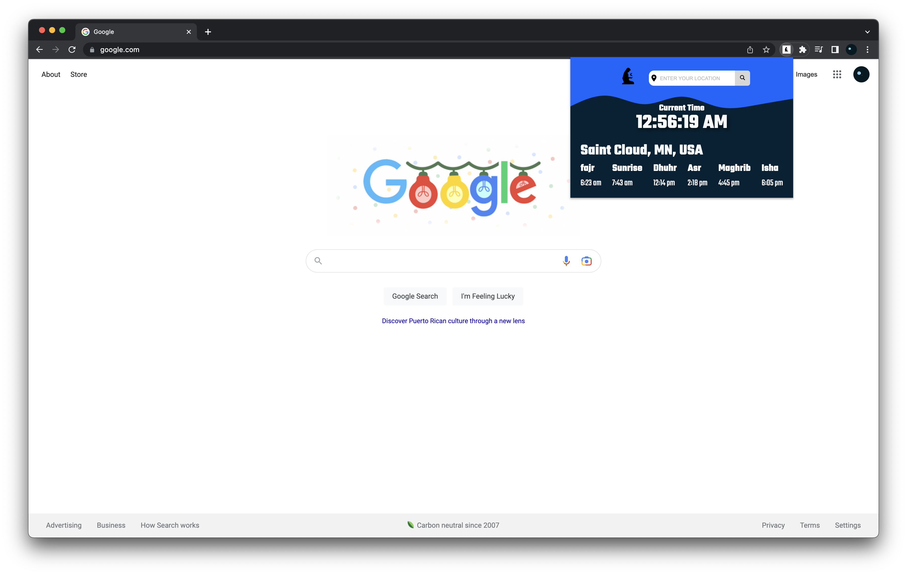

# Prayer Time Chrome Extention

The Prayer Time Chrome Extension is a tool that allows users to
observe and access their daily prayer time directly from their
Chrome browser. It gives reliable and up-to-date information on
the five daily prayers. This extension is useful for Muslims who
desire to keep up with their daily religious responsibilities while
remaining connected to their faith.

## Screenshots

## Tech Stack

### These are the technologies that were used to build this project.

- HTML
- CSS
- JavaScript

## API Reference

### Muslimsalat API

#### The Muslimsalat API is used to retrieve data depending on city and country.

#### Request Example: https://muslimsalat.p.rapidapi.com/london.json

| Parameter  | Type     | Description                                                |
| :--------- | :------- | :--------------------------------------------------------- |
| `location` | `string` | **Required**. City or Country of the Prayer Times to fetch |

### Geolocation API

#### The Geolocation API is used to gather data in real-time and detect the user's current location. This built-in API returns the latitude and longitude of the user's current location.

### Reverse Geocoding API

#### Reverse geocoding API is applied to convert a user's latitude and longitude into a city.

| Parameter   | Type     | Description                                      |
| :---------- | :------- | :----------------------------------------------- |
| `latitude`  | `Number` | **Required**. The latitude of the user to fetch  |
| `longitude` | `Number` | **Required**. The longitude of the user to fetch |

## Authors

[Khalid Nur](https://github.com/khalid-nur)

## Feedback

Feel free to contact me if you have any concerns or comments at khalidnur150@gmail.com
